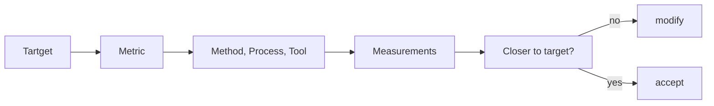

## 2023-09-27 - Approccio ingegneristico, Qualità del prodotto software, Qualità del processo

Ricerca di **tecniche** e **metodologie** per migliorare e assicurare un **software di qualità**.

## Approccio ingegneristico

Utilizzo una **metrica** per monitorare il possibile avvicinamento all'**obiettivo**. La metrica deve essere scelta **prima**, non a posteriori!

Vengono scelti dei **metodi**, dei **processi** e degli **strumenti** per ottenere un **avvicinamento** all'obiettivo. Viene poi **misurata la metrica** e viene valutato se ci siamo avvicinati all'obiettivo.

## Principali problemi

- Numero di **persone coinvolte**
  - il programmatore non è il cliente (problemi di comunicazione)
- **Dimensioni del software**
  - milioni di linee di codice
  - migliaia di anni/uomo _(totale del tempo se ci fosse un solo uomo a lavorarci)_: **non** è sempre detto che **aumentando** le risorse allora **diminuisce il tempo**, anzi alcune volte _peggiora_, per via della maggiore comunicazione _(1 donna per fare un bambino ci mette 9 mesi, 9 donne NON ci mettono 1 mese)_
- **SOFT**ware: modifiche ed evoluzioni
  - malleabilità porta al moltiplicarsi di versioni ed evoluzioni

## Qualità del prodotto software

Un **buon processo** porta ad un **prodotto di qualità**.

Quali sono le **qualità del software** a cui miriamo? In generale una qualità è un _qualcosa_ a cui _qualcuno_ tiene.

- che funzioni
- che sia bello
- che mi faccia diventare ricco

### Che funzioni

- **correttezza**: il risultato corrisponde ai requisiti
  - ma se è stato chiesto qualcosa di sbagliato o incompleto?
  - **R. Glass' Law (L1)**: La principale fonte di problemi e fallimenti sono gli errori e le mancanze nei requisiti
  - questo porta all'**importanza** di definire in modo **formale** e **non equivocabile** i **requisiti** (anche se costa _tempo_, _risorse_ ed è _antipatico_ sia al cliente che allo sviluppantore)
- **affidabilità**: è possibile fidarsi del comportamento del prodotto
- **innocuità** (safety) e **robustezza**: non causi problemi di sicurezza

Non basta che compili (anche se è **indispensabile**), ma deve anche **non andare in errore** in runtime e deve dare i **risultati corretti**.

### Che sia bello

**Proprietà esterne**: visibili a _chi usa_ il software _(cliente)_
**Proprietà interne**: visibili a _chi lavora_ al software _(sviluppatore)_ ma NON a chi lo sta usando (cliente)

- **usabilità**: quanto è facile, intuitivo da usare
  - **Nielsen-Norman's Law (L26)**: L'usabilità è quantificabile. _Si possono utilizzare delle metriche rilevabili attraverso degli esperimenti con utenti_
- **veloce**: efficienza del software nell'uso delle risorse
  - è una qualità _soft_ (non sempre è la cosa più importante, alcune volte può essere secondaria)
  - bisogna assicurare una **velocità accettabile**: è sempre possible _scalare_ l'hardware che fa girare il prodotto, ma se l'efficienza attuale è in _crescita esponenziale_ nemmeno l'hardware migliore del mondo riuscirà a far girare il software
- **pulito**: quanto il codice è leggibile e manutenibile (non percebile dall'utente, proprietà interna)
  - leggibile
  - **verificabilità**: facilmente _verificabile_ (dimostrare anche a persone terze che è corretto - _rubber duck programming_)
  - spesso un software _ottimizzato all'osso_ è anche _poco pulito_

### Che mi faccia diventare ricco

- **riusabilità**: non rifare qualcosa già fatto
  - riusabilità di componenti (sia _fatti da me_ che da _altri_)
  - **McIlroy's Law (L15)**: La riusabilità del codice _riduce_ il tempo di sviluppo e _aumenta_ la qualità e la produttività
  - _attenzione_: esistono dei fallimenti del software dovuti alla riusabilità _(razzo ariane 5)_
- **manutenibilità**: ridurre gli interventi post consegna
  - correzione errori (**riparabilità**)
  - estensione dei requisiti, nuove sitazioni (**evolvibilità**)

**Debito tecnico**: presenza di un _qualcosa_ che è _scritto male_, ma **NON** ho **necessità immediata** per risolverla. Ignorata diventa debito tecnico, ovvero qualcosa che col tempo crescerà e potrebbe portare ad errori.\
Sistemare questo problema porta ad una **manutenzione perfettiva**.

**M. Lehman's Laws (L27 e L28)**: un sistema che viene usato verrà _cambiato/aggiornato_. Un sistema che si evolve _aumenta_ la sua _complessità_ (dovuta agli aggiornamenti), salvo che non venga fatto del _lavoro per ridurla_ (la complessità).

## Qualità del processo

Anche il processo deve funzionare, essere bello e farmi diventare ricco. Nello specifico:

- **robustezza**: resistere agli imprevisti
- **produttività**: essere veloce
- **tempismo**: cogliere l'attimo _(un prodotto deve essere a tempo con i bisogni del mercato / richieste del cliente)_
