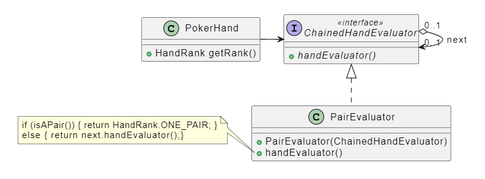

## Chain Of Responsibility

### Obiettivo

Abbiamo un client che esegue una richiesta e una **catena di potenziali gestori**, di cui non sappiamo a priori chi sarà in grado di gestire la richiesta.

Il pattern risolve il disaccoppiamento tra client e gestore concatenando i gestori.

### Come

Creazione di un **interfaccia** a cui tutti i gestori devono aderire, contente solamente la dichiarazione di un metodo `evaluate`. Il client dovrà solamente creare la catena di gestori.

L'**ordine** in cui vengono assemblati i gestori conta, in quanto la valutazione procede sequenzialmente.

Il metodo `evaluate`, implementa la **logica decisionale** che permette di stabilire se il gestore è in grado di gestire la richiesta. Se non è in grado, viene chiamato lo stesso metodo sul **prossimo gestore** (`next`), ottenuto come parametro al momento della costruzione.



### Testing

È consigliabile testare ogni nodo della chain in maniera **indipendente**. Una volta testati tutti i nodi _singolarmente_, è utile anche implementare un test per testare la chain nella sua interezza.

Test singolo nodo:

```java
@Test
void onePairTest(){
	PokerHand onePair = new PokerHand(...);

	// al posto del null è preferibile il NULLOBJECT
	ChainedHandEvaluator evaluator = new OnePairEvaluator(null);
	assertThat(evaluator.handEvaluator(pokerHand)).isEqualTo(HandRank.ONE_PAIR)
}
```

### Esempio _(poker)_

La valutazione del **punteggio**, avviene utilizzando una chain of responsibility. L'interfaccia `ChainedHandEvaluator` espone un metodo `getRank(Poker hand)` che calcola il punteggio della mano.

Per ogni tipologia di punteggio che si vuole valutare occorrerà implementare un sotto-tipo (**nodo** della catena) appropriato per `ChainedHandEvaluator`.

La catena inizierà a valutare il punteggio più alto, ovvero `HandRank`, il bottom della catena sarà `HIGH_CARD`, il quale non avrà un prossimo gestore.

È opportuno avere una **fine della catena** creata tramite il patter **Null Object**, in modo da non avere problemi di uscita dalla catena (`NullPointerException`).


``` java
public interface ChainedHandEvaluator {
    HandRank handEvaluator(PokerHand hand);

    // fine della catena, con Null Object
    ChainedHandEvaluator HIGH_CARD = (@NotNull PokerHand hand) -> HandRank.HIGH_CARD;
}
```

``` java
public class OnePairEvaluator implements ChainedHandEvaluator {

    private final ChainedHandEvaluator next;

    // al costruttore, passo un oggetto
    // ChainedHandEvaluator,ovvero il next della catena
    public OnePairEvaluator(@NotNull ChainedHandEvaluator next) {
        this.next = next;
    }

	// è necessario passare la mano ad ogni gestore.
    @Override
    public HandRank handEvaluator(@NotNull PokerHand hand) {
        if (isOnePair(hand))
            return HandRank.ONE_PAIR; //ritorno true
        return next.handEvaluator(hand); //passo al successivo gestore
    }

	// torna true se ci sono due carte con lo stesso rank nella mano.
    private boolean isOnePair(@NotNull PokerHand hand) {
        var cardSet = new HashSet<Rank>();
        for (Card c : hand) {
            if (cardSet.contains(c.getRank()))
                return true;
            cardSet.add(c.getRank());
        }
        return false;
    }
}
```

```java
private static final ChainedHandEvaluator chain =
    new StraightFlushEvaluator(
        new FourOfAKindEvaluator(
            new FullHouseEvaluator(
                new FlushEvaluator(
                    new StraightEvaluator(
                        new ThreeOfAKindEvaluator(
                            new TwoPairEvaluator(
                                new OnePairEvaluator(
                                    ChainedHandEvaluator.HIGH_CARD))))))));
```
