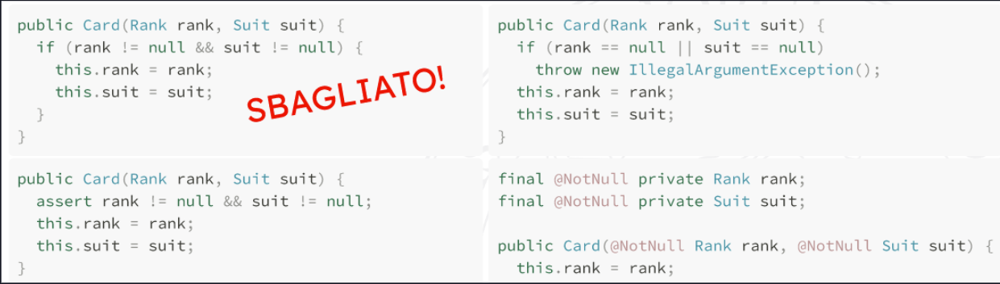

## Null Object

### Obiettivo

L'utilizzo del valore `null` nel codice è **sconsigliato**, in quanto può avere significati diversi:

- un _errore_ a runtime
- uno stato temporaneamente incosistente
- un valore assente o non valido
- semantica interna alla classe

Ogni vota che si utilizza il valore `null`, il codice diventa **meno chiaro**. Bisognerebbe specificare attraverso un commento o la documentazione, specificando l'**accezione** con cui viene utilizzato.

Gestione dei valori `null` in metodi:



Il pattern si pone quindi come obiettivo creare un **oggetto concreto** che ha il **significato** di _nessun valore_ o _valore neutro_, senza utilizzare `null`.

### Come

Si crea un **oggetto statico** di nome `NULL` all'interno della **classe** o dell'**interfaccia** che definisce l'oggetto di cui vogliamo avere un **valore neutro**.

L'oggetto `NULL` fornirà particolari implementazioni dei metodi della classe: ogni metodo viene **ridefinito** nell'oggetto `NULL` come se esso venisse chiamato su un vero `null` nel normale flusso di esecuzione.

``` java
public interface CardSource {
	Card draw();
	boolean isEmpty();

	// è static e public (nelle interfacce è superfluo specificarlo)
	CardSource NULL = new CardSource() {
		public boolean isEmpty() {
			return true;
		}
		public Card draw() {
			assert !isEmpty();
			return null;
		}
	}
}
```

È consigliato utilizzare il pattern quando il client ha bisogno di **controllare** se uno **specifico valore** è `null` per saltare l'esecuzione di alcune istruzioni o eseguire un comportamento di defualt.

In questi casi, potremmo incapsulare la **logica neutra** all'interno di un oggetto `NULL` e restituirlo al client invece del valore `null`. In questo modo il codice del client non ha più bisogno di **controllare** se una determinata istanza è nulla o meno (dato che avverrà nell'implementazione del nullobject).
