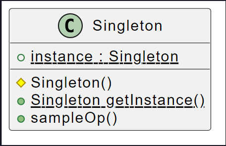

## Singleton

### Obiettivo

Talvolta vorremmo che un certo oggetto, esistesse in **una sola istanza**, perché di tale oggetto non ha senso esistano _diverse copie_ all'interno dell'applicazione.

_Tuttavia i linguaggi Object Oriented, gestiscono solamente classi con istanze multiple, la realizzazione dell'unicità può risultare dunque critica._

Quindi è necessario rendere la **classe stessa responsabile** del fatto che non può esistere più di una sua istanza.

### Come

Rendere **privato il costruttore**.

Bisogna però garantire un modo per **recuperare** l'unica **istanza** disponibile della classe, si crea dunque il metodo statico `getInstance`. Il metodo restituisce l'unica istanza della classe, **creandola** tramite il costruttore privato **se questa non è già presente**.

L'istanza è memorizzata in una **attributo statico** della classe, così da poterla restituire.



```java
public class Singleton {
	// salvo l'istanza per usarla dopo
	private static Singleton instance;

	// costruttore privato
	private Singleton() { ... }

	// getter statico
	public static Singleton getInstance() {
		if (instance == null) {
			instance = new Singleton();
		}
		return instance;
	}
}
```

In java è anche possibile utilizzare gli **ENUM**. L'oggetto viene definito attraverso un enumerativo con un **unico valore**, l'**istanza**.

Ciascun valore di un ENUM viene trattato nativamente da java come un Singleton:

- viene creato al suo **primo uso**
- **non** ne siste più di una copia
- chiunque vi acceda, accede sempre alla **medesima istanza**

All'interno di un ENUM è inoltre possibile creare **attributi** e **metodi**.

Questo approccio è **thread safe**, ovvero non abbiamo problemi di concorrenza.

```java
public enum MySingleton {
	INSTANCE;
}
```

### Problematiche

Per come è stata scritta la classe, non viene presa in considerazione la **concorrenza**. Se due processi accedono in modo **concorrente** al metodo `getInstance`, entrambi passano il controllo `instance == null`, in quanto non è ancora creata e assegnata al relativo attributo statico nell'altro processo, creando due istanze.

Soluzione: lock sull'esecuzione del metodo, anteponendo la direttiva `@Synchronized`. _Non utilizzata in quanto avremo un calo di prestazioni._
