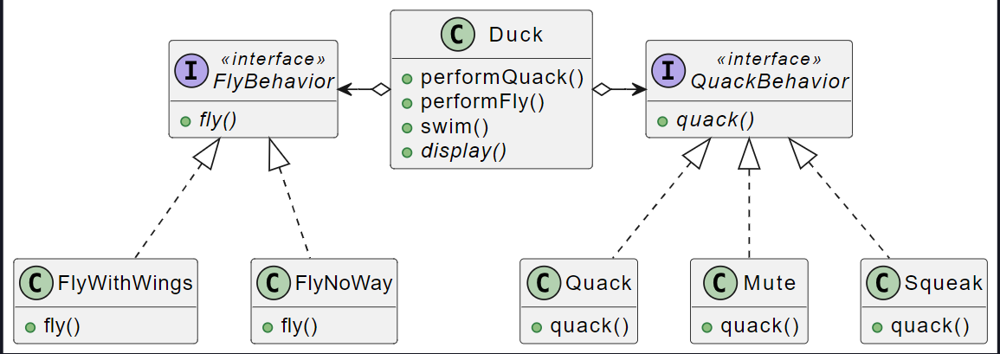
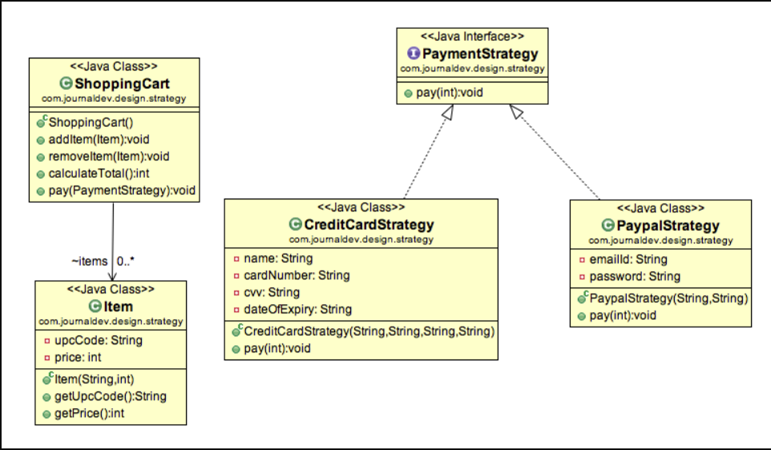

## Strategy

### Obiettivo

Talvolta nelle nostre classi vogliamo definire dei **comportamenti diversi** per **istanze diverse**, tuttavia la normale gerarchia di classi non va bene: verrebbero violati i principi di **Sostituzione di Liskov** e **Open Closed**.

_Esempio:_

Definiamo più algoritmi e lasciamo che l'_applicazione client_ passi l'_algoritmo da utilizzare come parametro_.

Uno dei migliori esempi di modello di strategia è `Collections.sort()`, il metodo che accetta il parametro `Comparator`. In base alle diverse implementazioni delle interfacce del comparatore, gli oggetti vengono ordinati in modi diversi.

### Come

**Principio di delega**: sostituisce all'_ereditarietà_ la **composizione**. Si tratta di individuare ciò che _rimane invariato_ e ciò che _rimane fisso_ nell'applicazione. Si creano:

- si creano delle **interfacce** per i comportamenti da **diversificare**
- si crea una **classe concreta** che usa ogni **comportamento** possibile

All'interno della classe originale si introducono dunque degli **attributi di comportamento**, impostati al **momento della costruzione** o con dei setter a seconda della dinamicità che vogliamo permettere. Quando viene richiesto il comportamento a tale classe essa si limiterà a **chiamare il proprio** _oggetto di comportamento_.



Nell'esempio non c'è scritto da nessuna parte che un anatra devo _volare_, ma solo che deve implementare la sua _politica di volo_.

### Esempio (shopping cart)

Il carrello della spesa oltre a contenere una serie di item, dovrà disporre un **attributo di comportamento** che esegue un _pagamento_.

Un pagamento può essere implementato da due strategie:

- pagamento con PayPal
- pagamento con carta di credito



```java
public class ShoppingCart {

	List<Item> items;

	public ShoppingCart() {
		this.items = new ArrayList<Item>();
	}

	// l'attributo comportamentale viene scelto tramite un setter, consente una maggiore dinamicità
	// il metodo prenderà un metodo di pagamento generico e si limiterà a chiamarlo.
	public void performPayment(PaymentStrategy paymentMethod) {
		int amount = calculateTotal();
		paymentMethod.pay(amount);
	}

	public int calculateTotal(){
		int sum = 0;
		for(Item item : items){
			sum += item.getPrice();
		}
		return sum;
	}

	public void add(Item item) { ... }
	public void remove(Item item) { ... }

}
```

Interfaccia strategia di pagamento:

```java
public interface PaymentStrategy {
	public void pay(int amount);
}
```

Strategia paga con carta, implementa il metodo di pagamento pay, specializzandolo per pagare con una carta di credito.

```java
public class CreditCardStrategy implements PaymentStrategy {

	private String name;
	private String cardNumber;
	private String cvv;
	private String dateOfExpiry;

	public CreditCardStrategy(String nm, String ccNum, String cvv, String expiryDate){
		this.name=nm;
		this.cardNumber=ccNum;
		this.cvv=cvv;
		this.dateOfExpiry=expiryDate;
	}

	@Override
	public void pay(int amount) {
		System.out.println(amount +" paid using credit/debit card");
	}

}
```

Strategia paga con PayPal
```java
public class PaypalStrategy implements PaymentStrategy {

	private String emailId;
	private String password;

	public PaypalStrategy(String email, String pwd){
		this.emailId=email;
		this.password=pwd;
	}

	@Override
	public void pay(int amount) {
		System.out.println(amount + " paid using Paypal");
	}

}
```
