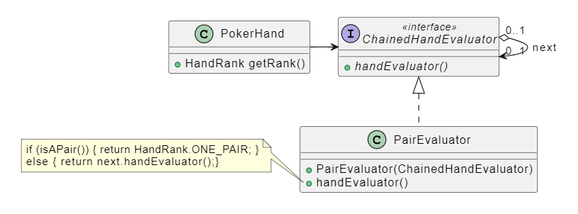

### Chain Of Responsability

<span style=color:green>Obbiettivo</span> := Abbiamo un client che esegue una richiesta e una <b><u>catena di potenziali gestori</u></b>, di cui non sappiamo a priori chi sarà in grado di gestire la richiesta.
Il pattern risolve il disaccoppiamento tra client e gestore
concatenando i gestori.

<span style=color:cyan>Come</span> := Creazione di un interfaccia a cui tutti i gestori devono aderire, contente solamente la dichiarazione di un metodo <span style=color:yellow>evaluate</span>. il client dovrà solamente creare la catena di gestori.
<span style=color:red>N.B</span> = l'ordine in cui vengono assemblati i gestori conta, in quanto la valutazione procede sequenzialmente.

il metodo <span style=color:yellow>evaluate</span>, implementa la logica decisionale che <b><u>permette di stabilire se il gestore è in grado di gestire la richiesta</b></u> . Se non è in grado, viene chiamato lo stesso metodo su un altro gestore ottenuto come parametro al momento della costruzione.



<span style=color:cyan;font-size:30px>Testing</span>

<b><u>è consigliabile, testare ogni nodo della chain in maniera singolare</u></b>.
Se c'è tempo è utile anche implementare un test per testare la chain nella sua interezza.

<span style=color:yellow>Come testare un singolo nodo</span> :
``` java
@Test
void onePairSuccessTest(){
	PokerHand onePair = new PokerHand(
		 List.of(
            Card.get(Rank.TEN, Suit.SPADES),
            ....
	)
	//al posto del null potevo passare l'oggeto creato con NULLOBJECT pattern
	ChainedHandEvaluator evaluator = new OnePairEvaluator(null); //non ho un next
	assertThat(evaluator.handEvaluator(pokerHand)).isEqualTo(HandRank.ONE_PAIR)
}
```

<span style=color:cyan;font-size:30px>Esempio Poker</span>:

La valutazione del punteggio, avviene secondo al chain-of-responsability. L'interfaccia `ChainedHandEvaluator` espone un metodo `getRank(Poker hand)` che calcola il punteggio della mano.
Per ogni tipologia di punteggio che si vuole valutare occorrerà implementare un sotto-tipo appropriato per `ChainedHandEvaluator`.
La catena inizierà a valutare il punteggio più alto, ovvero `HandRank`, il bottom della catena sarà `High_Card`, il quale non avrà un prossimo gestore.

<span style=color:red>N.B</span> := <b><u>Se la catena non prevede un bottom di deafault, è opportuno crearne uno nell'interfaccia tramite il NULLOBJECT pattern</u></b>.

Interfaccia <span style=color:yellow>ChainedHandEvaluator</span> :
``` java
public interface ChainedHandEvaluator {
    HandRank handEvaluator(PokerHand hand);
}
```

Classe <span style=color:yellow>OnePairEvaluator</span> :
``` java
public class OnePairEvaluator implements ChainedHandEvaluator {

    private final ChainedHandEvaluator next;

    //al costruttore, passo un oggetto
    //ChainedHandEvaluator,ovvero il next della catena
    public OnePairEvaluator(@NotNull ChainedHandEvaluator next) {
        this.next = next;
    }

	//è necessario passare la mano ad ogni gestore.
    @Override
    public HandRank handEvaluator(@NotNull PokerHand hand) {
        if (isOnePair(hand))
            return HandRank.ONE_PAIR; //ritorno true
        return next.handEvaluator(hand); //passo al successivo gestore
    }

	//torna true se ci sono due carte con lo stesso rank nella mano.
    private boolean isOnePair(@NotNull PokerHand hand) {
        var cardSet = new HashSet<Rank>();
        for (Card c : hand) {
            if (cardSet.contains(c.getRank()))
                return true;
            cardSet.add(c.getRank());
        }
        return false;
    }
}
```

Classe <span style=color:yellow>HighCard</span>, ovvero il <b><u>bottom della catena</u></b> :
``` java
public class HighCardEvaluator implements ChainedHandEvaluator {
    @Override
    public HandRank handEvaluator(@NotNull PokerHand hand) {
        return HandRank.HIGH_CARD;
    }
}
```
