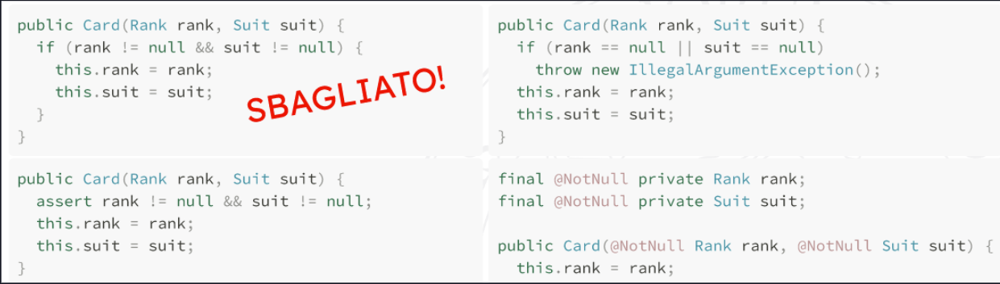

### Object Null

L'utilizzo del valore `Null` nel codice non è <b><u>troppo consigliato</u></b>, può avere significati diversi : 
- un errore a runtime.
- uno stato temporaneamente incosistente.
- un valore assente o non valido. 

Ogni vota che si utilizza il valore `Null`, il codice diventa meno chiaro. Bisognerebbe specificare attraverso un commento o la documentazione,  specificando l'accezione con cui viene utilizzato. 

<span style=color:red;font-size:30px>Strategie di gestione dei valori NULL</span>



<b><u>Le strategie di gestione dei valori Null, variano molto a secondo del significato assegnato a tale valore</u></b> :

 - <b><u>Quando non ci sono valori assenti</u></b> e dunque il `Null` indica solamente un errore, è sufficiente controllare che i parametri passati non siano `Null`, con condizioni, asserzioni o la notazione <span style=color:yellow>@NotNull</span> . 

- <b><u>Quando invece ci sono valori assenti</u></b> , ovvero che indicano situazioni particolari (*il joker in un mazzo di carte non ha rank e suit, possono essere a null*), la gestione è più complicata. 
  trattare i campi mancanti con valore `null` porterebbe ad ambiguità. 

<span style=color:green>Obbiettivo</span> := <b><u>Creare un oggetto che ha il significato di nessun valore o valore neutro, nasce il null object patthern</u></b> . 

<span style=color:cyan>Come</span>:= Si crea un <span style=color:yellow>oggetto statico di nome NULL</span> , all'interno della classe o dell'interfaccia che definisce l'oggetto di cui vogliamo avere un valore neutro.
L'oggetto NULL, <b><u>fornirà particolari implementazioni dei metodi della classe</u></b> : Ogni metodo viene ridefinito nell'oggetto NULL come se esso venisse chiamato su null nel normale flusso di esecuzione. 

``` java
public interface CardSource { 
	Card draw(); 
	boolean isEmpty(); 
	
	public static CardSource NULL = new CardSource() { 
		public boolean isEmpty() { 
			return true; 
		} 
		public Card draw() { 
			assert !isEmpty(); 
			return null; 
		} 
	} 
}
```

<span  style=color:green>Quando utilizzare il NULLOBJECT Pattern</span> = Utilizziamo il patthern, quando il client ha bisogno di controllare se uno specifico valore è null per saltare l'esecuzione di alcune istruzioni o eseguire un comportamento di defualt. 
In questi casi, potremmo incapsulare la logica neutra all'interno di un oggetto null e restituirlo al client invece del valore null. In questo modo il codice del client non ha più bisogno di sapere se una determinata istanza è nulla o meno.