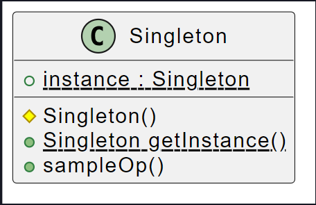

Talvolta vorremmo che un certo oggetto, esistesse in <span style=color:yellow>una sola istanza</span>, perchè di tale oggetto non ha senso esistano diverse copie all'interno dell'applicazione (*diverse istanze di una classe Gioco, in un sistema che gestice un gioco alla volta*).

Tutta via i linguaggi Object Oriented, gestiscono solamente classi con istanze multiple, la realizzazione dell'unicità può risultare dunque critica.

<span style=color:green>Obbiettivo</span> := <b><u>Rendere la classe responsabile del fatto che non può esistere più di una sua istanza</u></b>

<span style=color:cyan>Come</span> := Rendere privato il costruttore ( o se non privato, almeno protected ). Bisogna però garantire un modo per recuperare l'unica istanza disponibile della classe, <b><u>si crea dunque il metodo statico</u></b> <span style=color:yellow>getInstance</span>.

<span style=color:yellow>getInstance</span> := Restituisce a chi lo chiama l'unica istanza della classe, creandola tramite il costruttore privato se questa non è già presente.
<b><u>L'istanza è memorizzata in una attributo statico della classe</u></b>, così da poterla restituire a chi ne ha bisogno.



```java
public class Singleton {
	/* costruttore  privato o comunque non pubblico*/
	protected Singleton() { ... }

	/* salvo l'istanza per usarla dopo */
	private static Singleton instance = null;

	/* metodo statico*/
	public static Singleton getInstance() {
		if (instance == null) {
			instance = new Singleton();
		}
		return instance;
	}

	public void metodoIstanza() { ... } }
```

<span style=color:red;font-size:30px;>Problematiche</span>:
Tutta via per come è stata scritta la classe, <b><u> non prende in considerazione la concorrenza</u></b>. Se due processi accedono in modo concorrente la metodo <span style=color:yellow>getInstance</span>, entrambi passano il controllo `instance == null`, in quanto non è ancora creata e assegnata al relativo attributo statico nell'altro processo.

<span style=color:green;font-size:30px;>Soluzioni</span>:
- Lock sull'esecuzione del metodo, anteponendo la direttiva `@Synchronized`. Non utilizzata in quanto avremo un calo di prestazioni.

- In java è possibile utilizzare gli <span style=color:yellow>ENUM</span>.
  l'oggetto viene definito attraverso un enumerativo con un unico valore, l'istanza.
  Ciascun valore di un enum viene trattato nativamente da java come un Singleton :
  - <b><u>Viene creato al suo primo uso</u></b>.
  - <b><u>Non ne siste più di una copia</u></b>.
  - Chiunque vi acceda, <b><u>accede sempre alla medesima istanza</u></b> .

All'interno di un enum è inoltre possibile creare attributi e metodi.
Questo approccio è <b><u>thread safe</u></b>, ovvero non abbiamo problemi di concorrenza.

```java
public enum MySingleton {
	INSTANCE;
	public void metodoIstanza() { ... }
}
MySingleton.INSTANCE.sampleOp();
```

