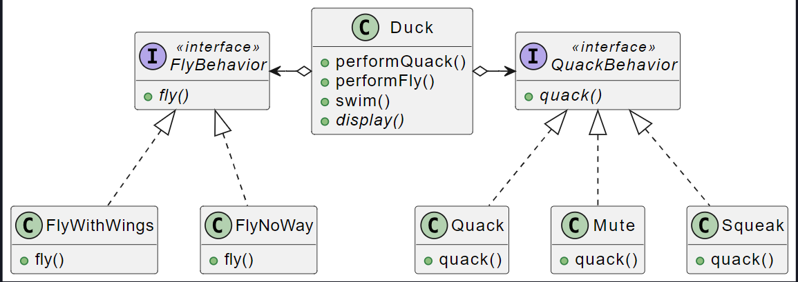
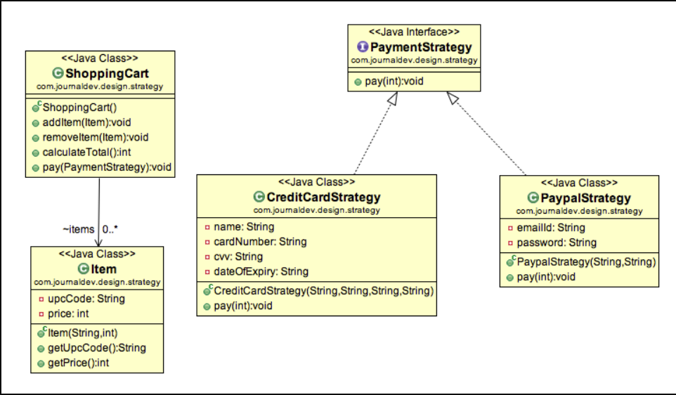

### Strategy pattern 

<span style=color:green>Obbiettivo</span> :=  Talvolta nelle nostre classi vogliamo definire dei <b><u>comportamenti diversi per istanza diverse</u></b>, tutta via la normale gerarchia di classi non va bene. <span style=color:red>Violerrebbe i principi di Sostituzione di liskov e Opne Close</span>. 

*Esempio* : 
Definiamo più algoritmi e <b><u>lasciamo che l'applicazione client passi l'algoritmo da utilizzare come parametro</u></b>. Uno dei migliori esempi di modello di strategia è `Collections.sort()`il metodo che accetta il parametro Comparator. In base alle diverse implementazioni delle interfacce del Comparatore, gli oggetti vengono ordinati in modi diversi

<span style=color:cyan>Soluzione</span> := <span style=color:yellow>Principio di delega</span>, <b><u>che sostituisce all'eriditarietà la composizione</u></b>. Si tratta di individuare ciò che rimane invariato e ciò che rimane fisso nell'applicazione. Si creano : 
 - <b><u>Si creano delle interfaccie per i comportamenti da diversificare</u></b> 

 - <b><u>Si crea una classe concreta che usa ogni comportamento possibile</u></b> 

All’interno della classe originale si introducono dunque degli <span style=color:cyan>attributi di comportamento</span> , <b><u>impostati al momento della costruzione</u></b> o con dei setter a seconda della dinamicità che vogliamo permettere. 
<b><u>Quando viene richiesto il comportamento a tale classe essa si limiterà a chiamare il proprio “oggetto di comportamento”</u></b>. 



Nell'esempio non c'è scritto da nessuna parte che un anatra devo volare, ma solo che deve implementare la sua politica di volo. 

<span style=color:cyan;font-size:30px>Esempio con Shopping Cart</span> 

Implementeremo ora un carrello della spesa. Il carrello della spesa oltre a contenere una serie di item, dovrà disporre un <span style=color:cyan>attributo di comportamento</span> che esegue un pagamento. 
Un pagamento può essere implementato da due strategie : 
- <b><u>Pagamento con paypall</u></b> 
- <b><u>Pagamento con carta di credito</u></b> 



<span style=color:orange>Classe shopping Cart</span>  :
``` java
public class ShoppingCart {

	List<Item> items;
	
	public ShoppingCart() {
		this.items = new ArrayList<Item>();
	}

	//in questo caso l'attributo comportamentale, viene scelto   tramite un setter, consente una maggiore dinamicità
	//il metodo prenderà un metodo di pagamento generico e si limiterà a chiamarlo. 
	public void performPayment(PaymentStrategy paymentMethod){
		int amount = calculateTotal();
		paymentMethod.pay(amount);
	}

	public int calculateTotal(){
		int sum = 0;
		for(Item item : items){
			sum += item.getPrice();
		}
		return sum;
	}
	
	public void add(Item item)
	public void remove(Item item).....


}
```

<span style=color:yellow>Interfaccia strategia di pagamento</span>:
``` java
public interface PaymentStrategy {
	public void pay(int amount);
}
```

<span style=color:red>strategia paga con carta</span>. Implementa il metodo di pagamento pay, specializzandolo per pagare con una carta di credito. 
``` java
public class CreditCardStrategy implements PaymentStrategy {

	private String name;
	private String cardNumber;
	private String cvv;
	private String dateOfExpiry;
	
	public CreditCardStrategy(String nm, String ccNum, String cvv, String expiryDate){
		this.name=nm;
		this.cardNumber=ccNum;
		this.cvv=cvv;
		this.dateOfExpiry=expiryDate;
	}
	
	@Override
	public void pay(int amount) {
		System.out.println(amount +" paid with credit/debit card");
	}

}
```

<span style=color:red>strategia paga con paypall</span>
``` java
public class PaypalStrategy implements PaymentStrategy {

	private String emailId;
	private String password;
	
	public PaypalStrategy(String email, String pwd){
		this.emailId=email;
		this.password=pwd;
	}
	
	@Override
	public void pay(int amount) {
		System.out.println(amount + " paid using Paypal.");
	}

}
```
